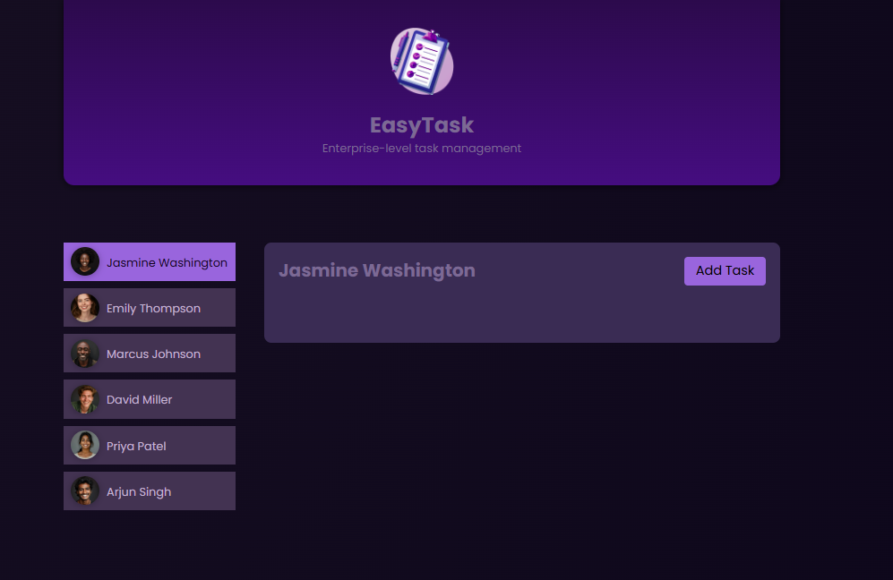
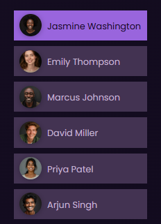
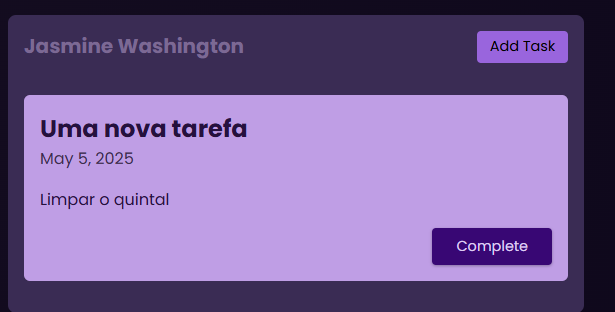

# NewProject
## Visão geral

## User

## Nova Tarefa

## Board de tarefas

## Sobre o projeto
Projeto foi feito usando Angular 19.
Explorando funcionalidades como Signal, Components, Services, estrutura de relacionamento e comunicação pai e filho (input e output)

Explorei novas funções do Angular 19: Como @if () {} no próprio HTML.
Entre outras coisas.

